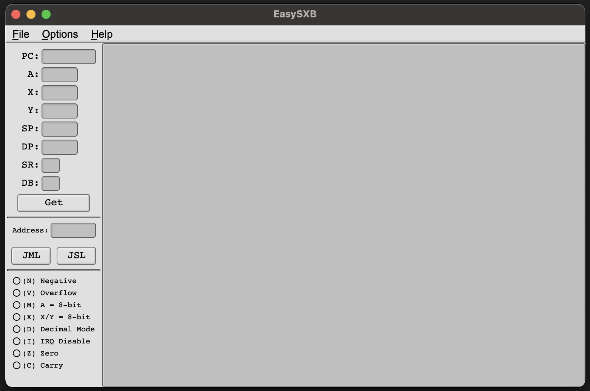

# 65816-environment

# Setting up dev environment on M1

This tutorial will be primarily targeted at the WDC 65xxCELER8R Series of engineering boards, and future subsequent homebrew derivations of this board. 


### Setting up EasySXB

EasySXB has a dependency on the FLTK C++ library found here https://github.com/fltk/fltk.

```
git clone git@github.com:relistan/EasySXB.git
cd EasySXB

curl -o FLTK-release-1.3.8.tar.gz https://codeload.github.com/fltk/fltk/tar.gz/refs/tags/release-1.3.8
tar -zxvf FLTK-release-1.3.8.tar.gz
mv fltk-release-1.3.8 fltk-1.3.8

```


Edit the EasySXB make file and update the version of fltk to 1.3.7, as this version works on Apple Silicone/M1 processors. This needs to be done through out the file as the version is not paramertised.

Note this strange sed format is required on OSX

```
homebrew install autoconf
sed -i '' -e "s/fltk-1.3.3/fltk-1.3.8/g" Makefile 
```


In the EasySXB directory run make against the fltk target.
``` 
make fltk
```

you should see
``` 
FLTK libs built!
```

now run the make.

```
make
chmod +x easysxb
```

you should now have an easysxb file that can be executed

``` 
./easysxb
```

The running program looks like this.



